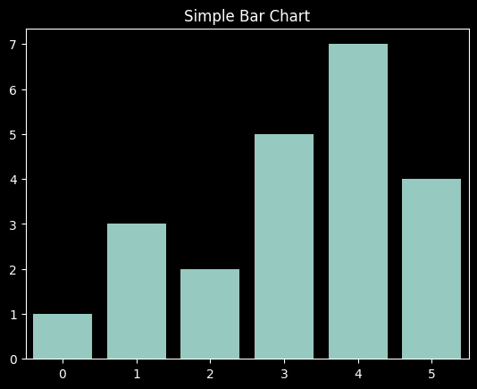

<!-- _class: lead -->
# BSBINS401 - Analyse and Present Research Information

## Session 2: Data Visualization Basics and Tools Overview  

Lecturer: Jordan Hill

<style scoped>
    p {
        padding: 0.25em;
  padding-right: 1em;
  text-align: right;
}
</style>

---

## Learning Objectives

- Understand different types of graphs and when to use them  
- Familiarize with key data visualization tools and platforms  
- Learn basic functionalities of Jupyter Notebooks and Kaggle  
- Get an overview of Matplotlib and Seaborn libraries  

---

## What is Data Visualization?

- **Definition**: The practice of translating information into a visual context  
- **Purpose**:
  - Simplify the interpretation of complex data  
  - Reveal patterns, trends, and correlations  
  - Enhance data-driven decision making  

---

## Key Graph Types and Their Uses

<table style="margin: 2em 2em 2em 2em ; justify-content: center; padding: 0em 5em 0em 0em ; text-align: left;">
  <tr>
    <th style="padding: 0.5em 1em;">Graph Type</th>
    <th style="padding: 0.5em 1em;">Use Case</th>
  </tr>
  <tr>
    <td style="padding: 0.5em 1em;">Line Chart</td>
    <td style="padding: 0.5em 1em;">Trend over time</td>
  </tr>
  <tr>
    <td style="padding: 0.5em 1em;">Bar Chart</td>
    <td style="padding: 0.5em 1em;">Comparing discrete categories</td>
  </tr>
  <tr>
    <td style="padding: 0.5em 1em;">Scatter Plot</td>
    <td style="padding: 0.5em 1em;">Relationship between two variables</td>
  </tr>
  <tr>
    <td style="padding: 0.5em 1em;">Histogram</td>
    <td style="padding: 0.5em 1em;">Frequency distribution of data</td>
  </tr>
</table>

---

## Tools for Data Visualization

- **Jupyter Notebooks**  
  - Interactive computing environment supporting live code, equations, visualizations, and narrative text  
  - [Jupyter Notebook Introduction Tutorial](https://jupyter.org/try-jupyter/notebooks/?path=notebooks/Intro.ipynb)
- **Kaggle**  
  - Platform for data science competitions and public datasets  
  - Includes an in-browser coding environment  
- **Visualization Libraries**  
  - **Matplotlib**: Standard plotting library for Python ([Matplotlib Getting Started](https://matplotlib.org/stable/tutorials/introductory/usage.html))  
  - **Seaborn**: High-level interface built on Matplotlib for statistical graphics ([Seaborn Introduction](https://seaborn.pydata.org/introduction.html))

---

## Jupyter Notebook & Kaggle Overview

- **Jupyter Notebooks**:
  - Ideal for iterative development and data exploration
  - Combines code, output, and rich text in a single document
- **Kaggle**:
  - Create and share notebooks online
  - Explore datasets and participate in competitions
- **Demo**:
  - In-class demonstration of starting a notebook and navigating Kaggle

---

## Introduction to Matplotlib and Seaborn

- **Matplotlib**:
  - Widely used for creating static plots  
  - Offers detailed control over every aspect of a figure  
- **Seaborn**:
  - Simplifies creating attractive statistical graphics  
  - Provides high-level interfaces for drawing appealing graphs  

---

## Example Activity:
  - Plot simple line charts and bar charts using sample code snippets
  
```python
import matplotlib.pyplot as plt
import seaborn as sns

# Sample data
data = [1, 3, 2, 5, 7, 4]

# Matplotlib example
plt.plot(data)
plt.title("Simple Line Chart")
plt.show()

# Seaborn example
sns.barplot(x=list(range(len(data))), y=data)
plt.title("Simple Bar Chart")
plt.show()
```



---

## In-Class Activities

- **Explore Jupyter Notebooks and Kaggle**:  
  - Create a new notebook and run a "Hello, World!" cell  
  - Browse Kaggle to locate datasets and review notebook examples  
- **Experiment**:  
  - [Activity: Explore Different Types of Graphs](https://piktochart.com/blog/types-of-graphs/)  
  - Modify code snippets (colors, labels, etc.) to create your own visualizations

---

### Activities
- **Activity: [Exploring Different Types of Graphs](https://piktochart.com/blog/types-of-graphs/)**
- **Jupyter Notebook: [Introduction Tutorial](https://jupyter.org/try-jupyter/notebooks/?path=notebooks/Intro.ipynb)**

### Lab Resources
- **Lab: [Markdown in Jupyter Notebooks](https://colab.research.google.com/notebooks/markdown_guide.ipynb)**
- **Lab Exercise: [Simple Plotting with Matplotlib](https://colab.research.google.com/notebooks/charts.ipynb)**

---

## Additional Resources

- **Matplotlib Documentation**: [Getting Started](https://matplotlib.org/stable/tutorials/introductory/usage.html)  
- **Seaborn Documentation**: [Introduction](https://seaborn.pydata.org/introduction.html)  
- **Kaggle Learn**: [Intro to Data Visualization](https://www.kaggle.com/learn/data-visualization)  
- **Jupyter Notebook Tutorials**: [Jupyter Docs](https://jupyter.org/documentation)  


---

## Further Reading
- **Article: [Data Visualization Best Practices](https://www.tableau.com/learn/articles/data-visualization)**

---

## Summary & Next Steps

- **Today's Session**:  
  - Reviewed key graph types, visualization tools, and platforms  
  - Demonstrated usage of Jupyter Notebook and Kaggle  
- **Next Session Preview**:
  - Dive deeper into data visualization techniques
  - Engage in more hands-on plotting exercises and explore advanced customization options

---

## Any Questions?

- Please ask any questions now or feel free to reach out during office hours.
- Contact: jordan.hill@nmtafe.wa.edu.au


